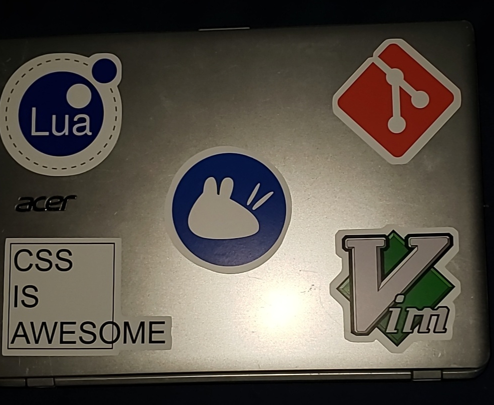

For this week, not as much work on the site as I'd like, but I did make progress on other things. Classes hit me like a truck, but in brighter news I got some cool stickers.

## dotfiles
I finally added more of my dotfiles _other_ than my `.vimrc`! This includes my terminal styles, `.bashrc`, and my global `.gitignore`! I also added a snazzy README for installation with symbolic links.

## Blog
I reworked the sidebar and messed with css to make it display properly. I also wrote a new post, but there's still some finishing touched I'd like to add before I release it to the wild.

## testgame
My passion project that I've been neglecting. I began work on an entity system with some OOP elements. This is the start of enemy AI.

## Personal
Remember those stickers I mentioned? Here's a cool pic! 

That's about it for this week, but a fun fact is that the stickers image is the first image used on the blog aside from my avatar on the landing page.
