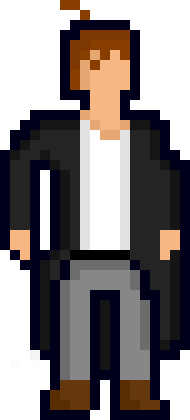
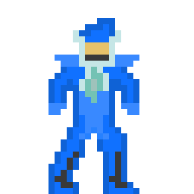
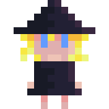
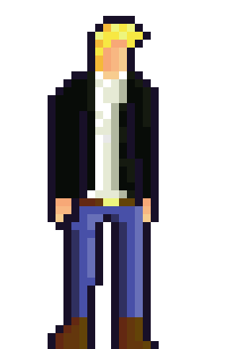
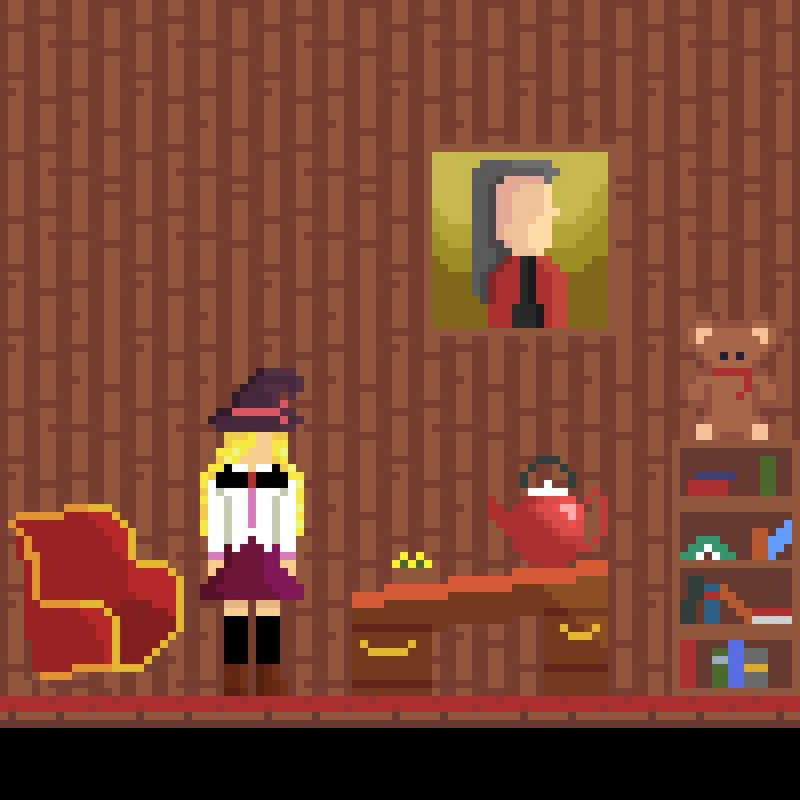

# Hindsight is 2020
This year has been crazy. If you'd told me at the last new years party I went to that we'd all be wearing surgical masks for most of the year, I'd have called you nuts. But despite that, no, because of that, it's important to keep busy and not let yourself fall into a slump. Here's what I got done.

## Code
We all knew this would be a major section of this post, so here goes:
* I wrote a [markdown-converter](https://github.com/TaizWeb/markdown-converter) in lua. Fun fact, it created this very page you're reading
* I began work on my dream game, then scrapped it into an [engine](https://github.com/TaizWeb/heartbeat)
* I wrote my own CoC, or rather, the [CoE](https://github.com/TaizWeb/code-of-excellency)
* I made a quick [tool](https://github.com/TaizWeb/music-dl) for ~~stealing~~ legally obtaining music off YouTube
* I participated in my first game jam, and produced [bit-bunny](https://taiz.itch.io/bit-bunny) in a weekend
* I did another game jam after, and created [Project Proton](https://taiz.itch.io/project-proton)
* I began another game, [Dyshexia](https://github.com/TaizWeb/dyshexia), but put it on the back burner for now
* I made a dumb snow effect for the site

## Art
This was the hardest thing for me, and something I was convinced I'd never gain any skill at: art. Games require a *load* of the stuff and I doubted I'd be able to find an artist willing to make sprite after sprite for me with no guarantee that it'd amount to anything. So I started on my own, with my first sprite being created in February.

## Everything Else
I authored **nine** blogposts, **eleven** devlogs, and **hundreds** of commits. I finished my hardest semester of uni (with honors!), managed to quit smoking (for over a month now) and I've broken all my personal fitness records.

## 2021
Honestly, I don't really believe in making new years resolutions. I feel like if I'm forcing myself to wait until an entire new year to make a change in my life, I don't actually want to change that much. However, there are some things I'd like to keep up with:
* Release the beta of my latest game
* Maintain my academic honors status
* Keep up my fitness streak

Just three things, how hard can it be? Thanks for reading, here's to a better year.

